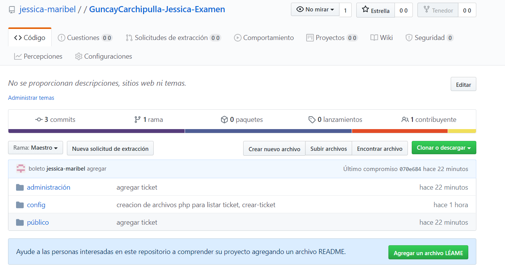

	TÍTULO: 
Examen de Programacion hipermedial con PHP

	ACTIVIDADES DESARROLLADAS
1.	Crer una carpeta dentro del servidor apache (htdocs) e identificacion con sus nombres completos

	Se creo la carpeta con el siguiente nombre como se muestra en la imagen

</img>

2.	Crer un proyecto publico en GitHub con el mismo nombre del punto anterior. 
	No se debe agregar el README ni la LICENCIA

	Se creo el repositorio con el nombre de GuncayCarchipulla-Jessica-Examen

</img>

3. Creacion de la base de datos y la relacion

	- Se creo una base de datos llamada "parqueadero"
	- Posee tres tablas:
		- Tabla "clientes" que contiene campos como: el codigo, cedula, nombre, 					apellido, direccion, correo y password
		- Tabla "vehiculo" que contiene campos como: codigo, placa, modelo y el 				codigo del cliente.

		-Tabla "ticket" que contiene campos como: codigo, fecha ingreso, hora 				ingreso, fecha salida, hora salida.

	- Representada de la siguiente manera en el digrama 

</img>

- Al momento de registrar Ticket se debe insertar datos del Ticket y Vehiculo, ademas, se debe ingresar la cedula del clienete para asociar con el vehiculo

- Diseño de la pagina parqueadero.html

</img>

- La realizacion del proyecto mediante PHP

</img>

- Al momento de ingresar la cedula del cliente y presionar el boton ¨Buscar Cliente¨ se debera mostrar la informacion del cliente extrayendola de la base de datos, para lo cual debera implementar funciones AJAX

- Diseño de la pagina 

</img>

</img>

- Listar los tickets, vehiculos y clientes asociados

</img>
